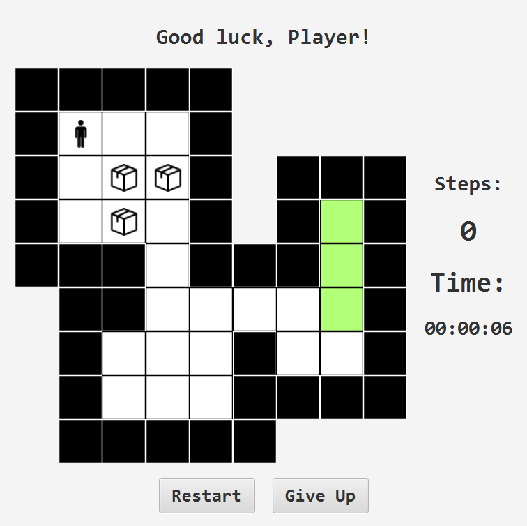
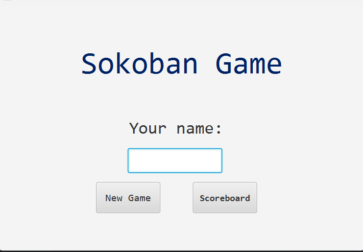
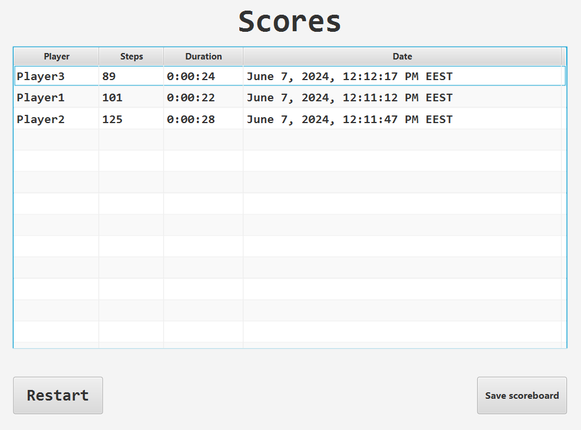

# Sokoban Game

## Game board

On the track surrounded by the wall shown in the figure, the little man must deliver each box to one of the fields
marked with green color. The man moves to an empty square adjacent to his current position
you can step or push a box that is four neighbors away from you if it lands on an empty square.

## Start screen

When starting the game, the player is greeted by a start screen where he must enter his name.

## Scoreboard

The game ranks the players based on the number of the steps taken.

## Additional information

The scoreboard for the game can be loaded from the start screen,
and can be saved on the scoreboard screen, after the finish.

## Steps to solve the game

RIGHT -> RIGHT -> DOWN -> DOWN -> DOWN -> DOWN -> RIGHT -> DOWN -> DOWN -> LEFT -> LEFT -> UP -> RIGHT -> DOWN
-> RIGHT -> UP -> LEFT -> UP -> UP -> UP -> UP -> UP -> LEFT -> LEFT -> DOWN -> RIGHT -> UP -> RIGHT -> DOWN
-> DOWN -> DOWN -> DOWN -> RIGHT -> RIGHT -> RIGHT -> DOWN -> RIGHT -> UP -> UP -> DOWN -> LEFT -> LEFT
-> LEFT -> DOWN -> DOWN -> LEFT -> LEFT -> UP -> RIGHT -> DOWN -> RIGHT -> UP -> LEFT -> UP -> UP -> UP -> UP
-> LEFT -> LEFT -> DOWN -> RIGHT -> UP -> RIGHT -> DOWN  -> DOWN -> DOWN -> RIGHT -> RIGHT -> RIGHT -> DOWN
-> RIGHT -> UP -> LEFT -> LEFT -> LEFT -> DOWN -> DOWN -> LEFT -> LEFT -> UP -> RIGHT -> DOWN -> RIGHT -> UP
-> LEFT -> UP -> RIGHT -> RIGHT -> RIGHT
